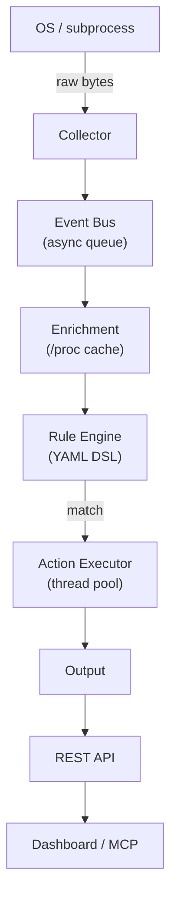

# Architecture

For the authoritative, fully detailed architecture document see:  
[`ARCHITECTURE.md` (root)](https://github.com/morgangch/eventd/blob/main/ARCHITECTURE.md)

---

## Pipeline at a glance

## Monorepo layers

| Path | Role |
|------|------|
| `core/` | Native C++17 engine — all pipeline stages |
| `cli/` | `eventctl` operator CLI |
| `web/backend/` | FastAPI REST API and orchestration |
| `web/frontend/` | React + Vite operator dashboard |
| `mcp/` | MCP server (Phase 3) |
| `proto/` | JSON Schema contracts shared across components |
| `deploy/` | Docker Compose, systemd, Kubernetes |

## Component overview

| Component | Docs |
|-----------|------|
| Event Collector | [collector](components/collector.md) |
| Event Bus | [event-bus](components/event-bus.md) |
| Enrichment Layer | [enrichment](components/enrichment.md) |
| Rule Engine | [rule-engine](components/rule-engine.md) |
| Action Executor | [action-executor](components/action-executor.md) |
| Output | [output](components/output.md) |
