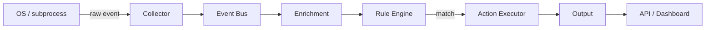

---
hide:
  - navigation
  - toc
---

<div class="hero" markdown>

# eventd

**A native system event engine with a declarative rule DSL.**  
Track processes. React to events. Automate responses.

[](https://github.com/morgangch/eventd/actions/workflows/ci-cd.yml)
[](https://github.com/morgangch/eventd/blob/main/LICENSE)
[](https://isocpp.org/)
[](https://python.org/)

[Get started in 60 seconds :material-rocket-launch:](getting-started/installation.md){ .md-button .md-button--primary }
[Browse the source :material-github:](https://github.com/morgangch/eventd){ .md-button }

</div>

---

## What is eventd?

**eventd** is a lightweight system event engine that captures OS-level events, enriches them with process context, and evaluates them against a declarative YAML rule DSL — all in a single, low-overhead C++ pipeline.

```
OS events ──▶ Collector ──▶ Bus ──▶ Enrichment ──▶ Rule Engine ──▶ Actions ──▶ Output
```

---

## Why eventd?

<div class="grid cards" markdown>

- :fontawesome-solid-bolt: **Low overhead**

    Native C++17 core. No agents, no JVM, no interpreted hot path.

- :material-file-code: **Declarative rules**

    Write rules in YAML. No code required to react to system events.

- :material-layers: **Full pipeline**

    From raw OS events to enriched, action-able records in microseconds.

- :material-api: **Open API**

    REST API, WebSocket feed, and a reserved MCP integration layer.

</div>

---

## Quick install

=== "Docker Compose"

    ```bash
    git clone https://github.com/morgangch/eventd.git
    cd eventd
    docker compose -f deploy/docker/docker-compose.yml up --build
    ```

=== "From source"

    ```bash
    git clone https://github.com/morgangch/eventd.git
    cd eventd
    cmake -S core -B core/build -DCMAKE_BUILD_TYPE=Release
    cmake --build core/build --parallel
    ./core/build/eventd-core
    ```

---

## Pipeline overview



---

## Components

| Component | Language | Role |
|-----------|----------|------|
| [Collector](components/collector.md) | C++ | Capture OS events |
| [Event Bus](components/event-bus.md) | C++ | Async decoupling queue |
| [Enrichment](components/enrichment.md) | C++ | `/proc` context layer |
| [Rule Engine](components/rule-engine.md) | C++ | YAML DSL evaluation |
| [Action Executor](components/action-executor.md) | C++ | Async action dispatch |
| [Output](components/output.md) | C++ / Python | Console, JSON, REST, UI |
| Backend API | Python (FastAPI) | REST + SSE bridge |
| Dashboard | TypeScript (React) | Operator web interface |
| MCP Server | Python | AI-agent integration (Phase 3) |
